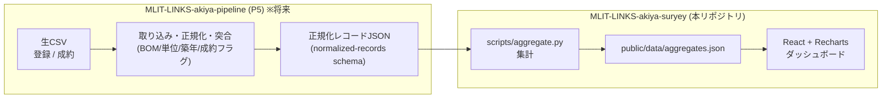

# MLIT-LINKS-akiya-suryey

国土交通省 Project LINKS が公開する「空き家・空き地バンク登録物件・成約物件データ（2025年度）」を、地域別に可視化する **空き家バンク市場ダッシュボード**です。自治体・不動産事業者が、地域ごとの登録在庫・成約・価格・築年などの傾向を把握することを想定しています。

**公開サイト**: https://shinyanakashima.github.io/MLIT-LINKS-akiya-suryey/

データベースを持たない**静的サイト**です。元データは年1回更新のため、ビルド時に集計済みJSONを生成し、ブラウザはそれを読み込んで描画します（実行時の外部API呼び出しはありません）。

## 主な機能

- 都道府県別の「登録残（在庫）× 成約」棒グラフ（上位15）
- 売買居住用の価格帯分布 / 築年数分布 / 建物構造 / 物件カテゴリ構成
- 都道府県ランキング表（登録残・成約・流動性%・価格中央値・築年中央値で並べ替え可能）
- 主要KPI（登録残、年間成約、価格中央値、築年中央値、100万円以下/無償件数）
- **日本語 / 英語の表示切替**（ヘッダー右上のトグル。初期表示は日本語。切替対象はUIラベルのみで、都道府県名・カテゴリなどのデータ由来の値は日本語のまま）

## アーキテクチャ

このリポジトリ（`suryey`）は **「正規化済みのレコードJSONを入力に、集計と描画だけを行う」** ことに責務を絞っています。生CSVの取り込み・正規化といった汎用的な前処理は、別リポジトリの共通パイプライン **`MLIT-LINKS-akiya-pipeline`（社内通称 P5）** に切り出す方針です。

| 工程 | 担当 |
|---|---|
| CSV取り込み（BOM/改行対応）、売買・賃貸の分離、金額の単位正規化、築年の丸め、列名整理・型付け、登録×成約の突合と成約フラグ付与 | `MLIT-LINKS-akiya-pipeline`（P5） |
| 正規化レコード → 集計（登録数 / 種別構成 / 築年分布 / 価格帯 / 成約傾向）、`aggregates.json` 生成、ダッシュボード描画 | 本リポジトリ（`suryey`） |

両者をつなぐ「正規化レコードJSON」の形式は [`schema/normalized-records.schema.json`](schema/normalized-records.schema.json)（JSON Schema）で固定しています。これが2リポジトリ間の契約です。

> **現状（暫定）**: P5 はまだ完成していないため、本リポジトリ内の `scripts/normalize.py` が生CSVから同スキーマ準拠の正規化レコードを生成し、ビルドが通るようにしています。P5 完成後はこのスクリプトを廃止し、P5 の出力を入力に差し替えるだけで動きます（後述）。

### データフロー



現状は P5 のブロックを、暫定の `scripts/normalize.py`（生CSV → 正規化レコードJSON）が代替しています。

## 技術スタック

| 層 | 採用技術 |
|---|---|
| フロントエンド | Vite + React + TypeScript |
| 可視化 | Recharts |
| 集計 | Python（標準ライブラリのみ。追加インストール不要） |
| ホスティング | GitHub Pages（GitHub Actions で自動デプロイ） |

## ディレクトリ構成

```
.
├── src/                       # フロントエンド（React）
│   ├── App.tsx                #   ダッシュボード本体（集計JSONを読み込み描画・日英切替）
│   └── types.ts               #   集計JSON (aggregates.json) の型定義
├── scripts/
│   ├── normalize.py           # 【暫定/将来P5へ移管】生CSV → 正規化レコードJSON
│   └── aggregate.py           # 正規化レコードJSON → public/data/aggregates.json
├── schema/
│   └── normalized-records.schema.json  # P5 ↔ 本リポジトリ の契約スキーマ
├── data/                      # 入力データ（生CSV・データ仕様書）
├── public/data/aggregates.json # フロントが読み込む集計済みJSON（ビルド成果物）
└── .github/workflows/deploy.yml # ビルド & GitHub Pages 公開
```

## セットアップと開発

前提: Node.js 20 系 / Python 3.11 系。

```sh
npm install        # 依存をインストール

npm run data       # 集計JSONを再生成（normalize → aggregate を一括実行）
npm run dev        # 開発サーバ http://localhost:5173/MLIT-LINKS-akiya-suryey/
npm run build      # 本番ビルド（dist/ を生成）
npm run preview    # ビルド結果をローカルで確認
```

`npm run data` の内訳:

```sh
npm run normalize  # 生CSV(data/*.csv) → data/normalized/records.json （暫定/P5代替）
npm run aggregate  # data/normalized/records.json → public/data/aggregates.json
```

## データの更新方法

### 現状（P5 完成前）

1. `data/01_tourokubukken.csv` / `data/02_seiyakubukken.csv` を最新版に差し替える（取得元は[データ出典](#データ出典)）。
2. `npm run data` を実行して `public/data/aggregates.json` を再生成する。
3. `main` に push すると自動でデプロイされる。

### P5 完成後（将来）

P5 が出力した正規化レコードJSONを `data/normalized/records.json` に置く（または環境変数で差し替える）だけで、`scripts/normalize.py` は不要になります。

```sh
RECORDS_JSON=/path/to/p5-output.json npm run aggregate
```

このとき `scripts/normalize.py` の削除と、`.github/workflows/deploy.yml` の normalize ステップ（→ P5 成果物の取得に差し替え）が残作業になります。

## デプロイ

`main` ブランチへの push をトリガーに、`.github/workflows/deploy.yml` が「集計JSON生成 → ビルド → GitHub Pages 公開」まで自動実行します。

初回のみ、GitHub リポジトリの **Settings > Pages > Build and deployment > Source** を **GitHub Actions** に設定する必要があります。

> 注: 公開URLのパスはリポジトリ名に依存します。`vite.config.ts` の `base`（現在 `"/MLIT-LINKS-akiya-suryey/"`）は、リポジトリ名と一致させてください。一致していないと公開サイトがアセットを読み込めず真っ白になります。

## データ出典

- データセット: [空き家・空き地バンク登録物件・成約物件データ（2025年度）](https://www.geospatial.jp/ckan/dataset/links-akiyabank-2025)（G空間情報センター）
- 提供: 国土交通省 総合政策局情報政策課 / Project LINKS（データ収集: 株式会社LIFULL）
- 対象時点: 2025/3/31
- ライセンス: 公共データ利用規約（第1.0版・CC-BY 4.0互換、商用利用可）

取得済みデータは `data/` 配下にあります。

| ファイル | 件数 | 内容 |
|---|---|---|
| `data/01_tourokubukken.csv` | 7,746 | 登録物件（価格・構造・面積・間取り・設備・周辺施設距離 等） |
| `data/02_seiyakubukken.csv` | 1,203 | 成約物件（上記＋成約日・成約金額） |
| `data/99_dataspec.xlsx` | – | データ仕様書（カラム定義） |

### 生CSVの再取得

```sh
mkdir -p data && cd data
curl -L -o 01_tourokubukken.csv "https://www.geospatial.jp/ckan/dataset/da1b7c8d-164f-4fdd-977b-3c49c7396c08/resource/d1cbba16-4972-4bab-bcf5-e275b26a18de/download/01_tourokubukken.csv"
curl -L -o 02_seiyakubukken.csv "https://www.geospatial.jp/ckan/dataset/da1b7c8d-164f-4fdd-977b-3c49c7396c08/resource/1dcf6cac-13bc-4505-b7dd-20dba3258a1d/download/02_seiyakubukken.csv"
curl -L -o 99_dataspec.xlsx "https://www.geospatial.jp/ckan/dataset/da1b7c8d-164f-4fdd-977b-3c49c7396c08/resource/220cf926-cd1a-4c4e-bba2-9d2b0c074d59/download/99_akiyabank_dataspecificationdocument_2025.xlsx"
```

## データの特徴と制約

ダッシュボードの設計はこのデータ特性を前提にしています。

- **物件種別**: 売買居住用が約6割、売買土地が約3割、賃貸居住用が約1割。
- **価格**: 売買中央値はおよそ420万円。100万円以下の超低価格帯や無償譲渡も一定数ある。
- **築年数**: 中央値はおよそ50年。築50年超が約4分の1を占め、再生・解体コストの検討が前提になる。
- **地域の偏り**: 登録は富山・北海道・岩手・兵庫などが上位。成約は大分・秋田が突出。
- **主な制約**:
  - 緯度経度がなく、都道府県＋市区町村のみ。地図化には市区町村のジオコーディングが別途必要。
  - 欠損が多い項目がある（駅徒歩、周辺施設距離、成約日・成約金額など）。本ダッシュボードは欠損に強い集計値ベースで構成している。
  - 元データの更新は年度単位。
