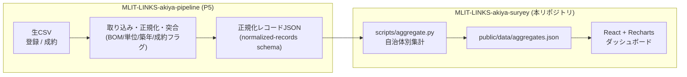

# MLIT-LINKS-akiya

国土交通省 Project LINKS が公開する「空き家・空き地バンク登録物件・成約物件データ（2025年度）」を可視化する **空き家バンク市場ダッシュボード**（案B）。

**公開先（GitHub Pages）**: https://shinyanakashima.github.io/MLIT-LINKS-akiya/

DBを使わない静的サイト構成（Vite + React + TS）。CSVは年1更新なので、ビルド時に集計JSONを生成し、ブラウザ側で描画する。

## 責務分担（スリム化方針）

生CSVの汎用的な前処理は **MLIT-LINKS-akiya-pipeline（P5）** へ移管し、本リポジトリは
**「P5が出力した正規化レコードJSONを入力に、集計と描画だけを行う」** 構成とする。

| 処理 | 担当 |
|---|---|
| CSV取り込み（BOM/改行対応）、売買賃貸分離、単位正規化、築年丸め、列名整理・型付け、登録×成約の突合と成約フラグ生成 | **P5（pipeline）** |
| 正規化レコード → 自治体別集計（登録数/種別構成/築年分布/価格帯/成約傾向）、`aggregates.json` 生成、描画 | **本リポジトリ（suryey）** |

P5とのインターフェース（正規化レコードの形）は [`schema/normalized-records.schema.json`](schema/normalized-records.schema.json) で固定している。

> **暫定措置:** P5が完成するまでは `scripts/normalize.py` がローカルの生CSVから
> スキーマ準拠の正規化レコード（`data/normalized/records.json`）を生成し、ビルドが
> 通るようにしている。P5完成後はこのスクリプトを廃止し、P5の出力JSONを
> `data/normalized/records.json` に置く（または環境変数 `RECORDS_JSON` で差し替える）だけでよい。

## データフロー



暫定構成では `P5` のブロックを `scripts/normalize.py`（生CSV → 正規化レコードJSON）が代替する。

## 技術スタック

| 層 | 採用 |
|---|---|
| 集計 | Python（標準ライブラリのみ）`scripts/aggregate.py` → `public/data/aggregates.json` |
| 正規化（暫定/将来P5） | Python `scripts/normalize.py` → `data/normalized/records.json` |
| フロント | Vite + React + TypeScript |
| 可視化 | Recharts |
| デプロイ | GitHub Pages + GitHub Actions（push to `main` で自動公開） |

## 開発

```sh
npm install
npm run normalize  # 【暫定/P5代替】data/*.csv -> data/normalized/records.json
npm run aggregate  # data/normalized/records.json -> public/data/aggregates.json
npm run data       # normalize + aggregate を一括実行
npm run dev        # http://localhost:5173/MLIT-LINKS-akiya/
npm run build      # dist/ を生成
npm run preview    # ビルド結果をローカル確認
```

P5の正規化レコードJSONが手元にある場合は、`scripts/normalize.py` を実行せずに
そのファイルを `data/normalized/records.json` に置く（または `RECORDS_JSON=/path/to/records.json npm run aggregate`）。

## デプロイ

`main` に push すると `.github/workflows/deploy.yml` が前処理→ビルド→Pages公開まで自動実行する。
初回のみ GitHub リポジトリの **Settings > Pages > Build and deployment > Source** を **GitHub Actions** に設定すること。


## データ出典

- データセット: [空き家・空き地バンク登録物件・成約物件データ（2025年度）](https://www.geospatial.jp/ckan/dataset/links-akiyabank-2025)（G空間情報センター）
- 提供: 国土交通省 総合政策局情報政策課 / Project LINKS（データ収集: 株式会社LIFULL）
- 対象時点: 2025/3/31
- ライセンス: 公共データ利用規約（第1.0版・CC-BY 4.0互換、商用利用可）

`data/` 配下に取得済み。

| ファイル | 件数 | 列数 | 内容 |
|---|---|---|---|
| `data/01_tourokubukken.csv` | 7,746 | 45 | 登録物件（価格・構造・面積・間取り・設備・周辺施設距離 等） |
| `data/02_seiyakubukken.csv` | 1,203 | 51 | 成約物件（上記＋成約日・成約金額） |
| `data/99_akiyabank_dataspecificationdocument_2025.xlsx` | – | – | データ仕様書（カラム定義） |

## 分析サマリ（アプリ設計の前提）

- **物件種別**: 売買居住用 63% / 売買土地 27% / 賃貸居住用 7%
- **価格**: 売買中央値 420万円、25%値 225万円。100万円以下 391件、無償譲渡 3件
- **築年数**: 中央値 50年、築50年超が 27%
- **地域偏在**: 登録は富山・北海道・岩手・兵庫が上位／成約は大分県が突出（303件）・秋田 148件
- **制約**:
  - 緯度経度なし（都道府県＋市区町村のみ）→ 地図化には市区町村ジオコーディングが必要
  - 欠損多: 駅徒歩 57% / スーパー・病院距離 13〜16% / 成約日 13% / 成約金額 8%
  - 更新は年度単位

## アプリ案

- **A. 全国・激安空き家ファインダー**（消費者向け）— 価格・築年・地域フィルタ＋ハザード/地価重ね合わせ
- **B. 空き家バンク市場ダッシュボード**（自治体・事業者向け）— 地域別の登録/成約/成約率/価格を可視化。欠損に強く着手しやすい【推奨】
- **C. 価格・成約予測ツール**（事業者向け）— 成約金額の充足率が低く、現状データでは時期尚早

## 再取得手順

```sh
mkdir -p data && cd data
curl -L -o 01_tourokubukken.csv "https://www.geospatial.jp/ckan/dataset/da1b7c8d-164f-4fdd-977b-3c49c7396c08/resource/d1cbba16-4972-4bab-bcf5-e275b26a18de/download/01_tourokubukken.csv"
curl -L -o 02_seiyakubukken.csv "https://www.geospatial.jp/ckan/dataset/da1b7c8d-164f-4fdd-977b-3c49c7396c08/resource/1dcf6cac-13bc-4505-b7dd-20dba3258a1d/download/02_seiyakubukken.csv"
curl -L -o 99_akiyabank_dataspecificationdocument_2025.xlsx "https://www.geospatial.jp/ckan/dataset/da1b7c8d-164f-4fdd-977b-3c49c7396c08/resource/220cf926-cd1a-4c4e-bba2-9d2b0c074d59/download/99_akiyabank_dataspecificationdocument_2025.xlsx"
```
